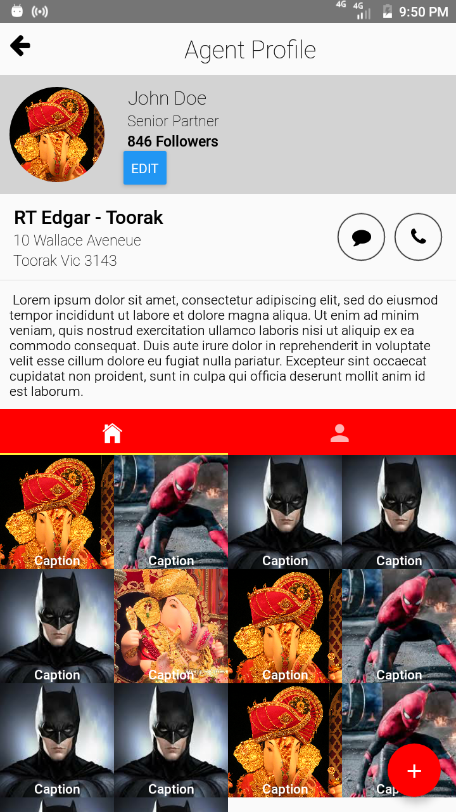
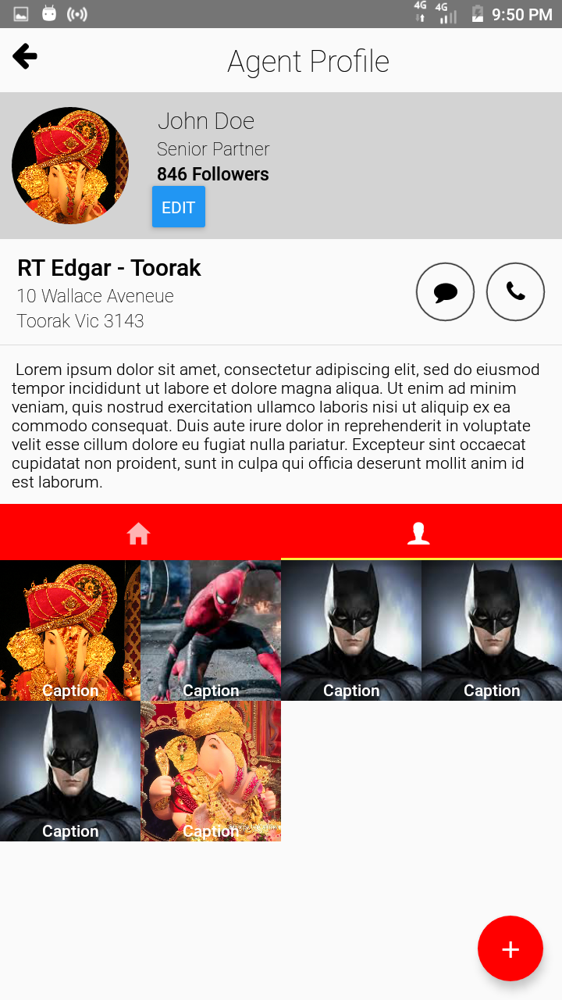
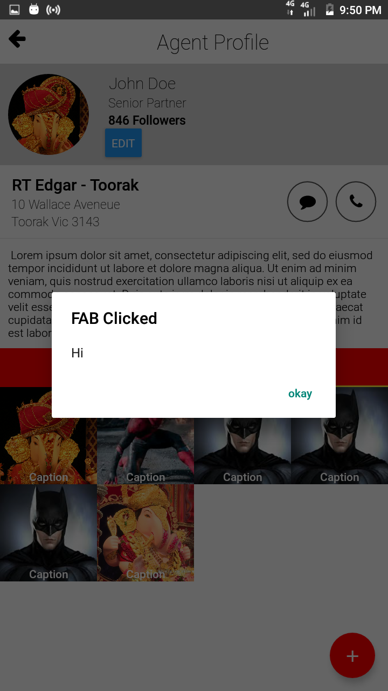

# EduChampAssignment
React native assignment given by Educhamp.
It includes creation of a basic profile screen.
Assignment highlights the usage of [Flex Box](./App.js).

### Components used from `react-native`
1.  Button
2.  StyleSheet
3.  View
4.  Text
5.  Image
6.  StatusBar
7.  Alert
8.  ImageBackground

### Components used from `react-navigation`. [Find Usage](./src/lib/router.js)
1. createAppContainer for tabs

### Components used from `react-navigation-tabs`. [Find Usage](./src/lib/router.js)
1. createMaterialTopTabNavigator used for Navigator with tabs at the top

### Other Packages used
* `react-native-vector-icons/FontAwesome` and `react-native-vector-icons/Ionicons` for Icons  [Find Usage](./App.js)
* `react-native-paper` for Floating Action Button and Divider.[Find Usage](./App.js)
* `react-native-gesture-handler` for ScrollView . [Find Usage](./src/screens)

### Output

